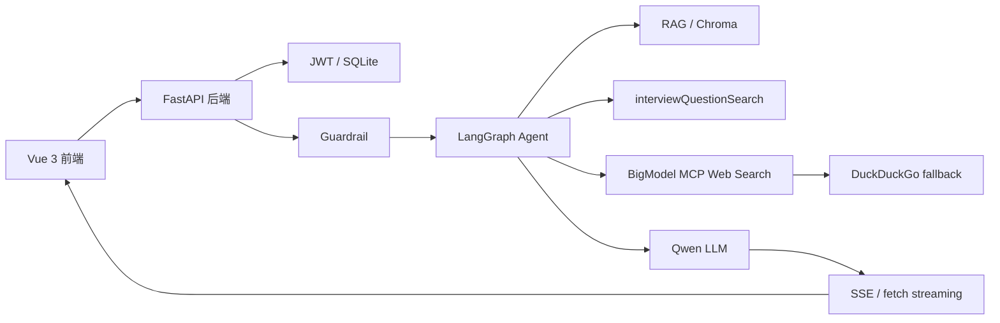
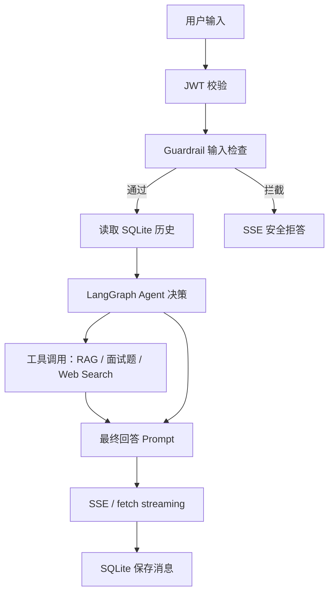

# AI 编程小助手

AI 编程小助手是一个面向编程学习、求职面试和技术资讯问答的 AI Assistant 项目。项目从为 Python FastAPI + LangGraph Agent 架构，同时保留 Vue 前端体验和流式聊天交互。

## 技术栈

- 前端：Vue 3、Vite、Marked、fetch ReadableStream
- 后端：Python、FastAPI、SQLAlchemy、SQLite、JWT、SSE
- Agent：LangGraph、OpenAI-compatible Chat Completions、Qwen
- RAG：Chroma、本地 Markdown 文档、OpenAI-compatible Embedding
- 工具：面试鸭面试题搜索、BigModel MCP Web Search、DuckDuckGo fallback
- 安全：JWT 鉴权、Guardrail 输入检查、API Key 环境变量化
- 部署：Uvicorn、Nginx/Docker、docker compose

## 功能特性

- 登录 / 注册 / JWT 登录态
- 会话列表、历史消息和 SQLite 持久化
- `/api/ai/chat` SSE 流式聊天
- LangGraph Agent 自主工具调用
- 本地 RAG 知识库检索
- 面试题搜索工具
- BigModel MCP Web Search，失败自动 fallback DuckDuckGo
- Guardrail 输入安全防护
- 参考来源折叠展示
- 停止生成 AbortController
- Web Search 日期幻觉修复，动态注入 `CURRENT_DATE`
- 会话时间统一 UTC ISO 8601，前端正确显示“刚刚 / x分钟前”

## 系统架构



更多细节见 [系统架构文档](docs/ARCHITECTURE.md)。

## Agent 工作流



更多细节见 [Agent 工作流](docs/AGENT_WORKFLOW.md)。

## 本地启动方式

### 1. 启动 Python 后端

```bash
cd D:\agent\python-backend
copy .env.example .env
pip install -r requirements.txt
python -m app.rag.build_index
uvicorn app.main:app --reload --host 0.0.0.0 --port 8000
```

健康检查：

```text
GET http://localhost:8000/api/health
```

### 2. 启动 Vue 前端

```bash
cd D:\agent\ai-code-helper-master\ai-code-helper-frontend
npm install
npm run dev
```

访问：

```text
http://localhost:5173
```

前端环境变量：

```env
VITE_API_BASE_URL=http://localhost:8000
```

## 云服务器部署方式

推荐使用 Ubuntu 22.04+。

### 后端

```bash
sudo apt update
sudo apt install -y python3 python3-venv python3-pip
cd /opt/python-backend
python3 -m venv .venv
source .venv/bin/activate
pip install -r requirements.txt
cp .env.example .env
python -m app.rag.build_index
uvicorn app.main:app --host 0.0.0.0 --port 8000
```

生产环境建议用 `systemd` 托管：

```ini
[Unit]
Description=AI Code Helper Backend
After=network.target

[Service]
WorkingDirectory=/opt/python-backend
EnvironmentFile=/opt/python-backend/.env
ExecStart=/opt/python-backend/.venv/bin/uvicorn app.main:app --host 0.0.0.0 --port 8000
Restart=always

[Install]
WantedBy=multi-user.target
```

### 前端

```bash
cd /opt/ai-code-helper-frontend
npm install
VITE_API_BASE_URL=https://your-domain.com npm run build
```

用 Nginx 托管 `dist/`，并反向代理 `/api/` 到后端：

```nginx
server {
  listen 80;
  server_name your-domain.com;

  root /opt/ai-code-helper-frontend/dist;
  index index.html;

  location / {
    try_files $uri $uri/ /index.html;
  }

  location /api/ {
    proxy_pass http://127.0.0.1:8000/api/;
    proxy_http_version 1.1;
    proxy_buffering off;
  }
}
```

## Docker 启动方式

已提供可选 Docker 配置：

```bash
cd D:\agent\ai-code-helper-master
docker compose up --build
```

服务地址：

- 前端：`http://localhost:3000`
- 后端：`http://localhost:8000`

首次启动前请准备：

```bash
copy D:\agent\python-backend\.env.example D:\agent\python-backend\.env
```

并填写模型和搜索相关 API Key。

## 环境变量说明

| 变量 | 说明 |
| --- | --- |
| `OPENAI_API_KEY` | OpenAI-compatible 模型 API Key |
| `OPENAI_BASE_URL` | DashScope / DeepSeek / OpenAI-compatible base URL |
| `MODEL_NAME` | 聊天模型，默认 `qwen-plus` |
| `TEMPERATURE` | 模型温度 |
| `MAX_MEMORY_MESSAGES` | 注入模型的历史消息条数 |
| `DATABASE_URL` | SQLite 数据库地址 |
| `JWT_SECRET_KEY` | JWT 密钥，至少 32 字节 |
| `JWT_EXPIRE_MINUTES` | JWT 过期时间 |
| `RAG_ENABLED` | 是否启用 RAG |
| `RAG_DOCS_DIR` | 文档目录 |
| `RAG_INDEX_DIR` | Chroma 索引目录 |
| `RAG_CHUNK_SIZE` | RAG chunk size |
| `RAG_CHUNK_OVERLAP` | RAG overlap |
| `RAG_TOP_K` | 检索 top k |
| `RAG_SCORE_THRESHOLD` | 相似度阈值 |
| `EMBEDDING_MODEL` | embedding 模型 |
| `WEB_SEARCH_ENABLED` | 是否启用联网搜索 |
| `BIGMODEL_API_KEY` | BigModel MCP Web Search API Key |
| `MCP_WEB_SEARCH_URL` | BigModel MCP endpoint |
| `WEB_SEARCH_TOP_K` | Web Search 数量 |
| `GUARDRAIL_ENABLED` | 是否启用输入安全防护 |
| `CORS_ORIGINS` | 前端允许来源 |

不要提交真实 API Key。

## RAG 索引构建

知识库文档目录：

```text
D:\agent\python-backend\data\docs
```

构建索引：

```bash
cd D:\agent\python-backend
python -m app.rag.build_index
```

索引输出：

```text
D:\agent\python-backend\data\vector_index
```

关闭 RAG：

```env
RAG_ENABLED=false
```

## MCP Web Search 配置

```env
WEB_SEARCH_ENABLED=true
BIGMODEL_API_KEY=
MCP_WEB_SEARCH_URL=https://open.bigmodel.cn/api/mcp/web_search_prime/mcp
WEB_SEARCH_TOP_K=5
```

调试接口：

```bash
curl "http://localhost:8000/api/tools/web/search?query=今天 OpenAI 有什么新闻&debug=true" ^
  -H "Authorization: Bearer <token>"
```

关注字段：

- `source_type=mcp`：来自 BigModel MCP
- `source_type=duckduckgo`：MCP 不可用时 fallback
- `mcp_status.parse_path`
- `mcp_status.raw_content_preview`

## Guardrail 测试方式

调试接口：

```bash
curl -X POST http://localhost:8000/api/guardrails/check ^
  -H "Content-Type: application/json" ^
  -H "Authorization: Bearer <token>" ^
  -d "{\"message\":\"how to make malware\"}"
```

预期返回：

```json
{
  "allowed": false,
  "reason": "dangerous_input_detected",
  "matched_terms": ["malware"]
}
```

聊天中命中 Guardrail 时，后端应直接 SSE 返回安全拒答，并打印：

```text
guardrail blocked conversationId=... matched_terms=...
```

## 常见问题

### 新建会话显示“8小时前”

确认后端返回时间带 `Z` 或 `+00:00`，例如 `2026-05-14T10:30:00Z`。当前实现会把历史 naive datetime 按 UTC 序列化。

### Web Search 一直走 DuckDuckGo

检查 `BIGMODEL_API_KEY`、`MCP_WEB_SEARCH_URL`、网络连通性，并用 `debug=true` 查看 MCP 状态。

### 回答里出现错误“今天”

最终回答 prompt 会动态注入 `CURRENT_DATE`，并对“今天（错误日期）”做输出后处理。检查后端日志：

```text
FINAL_CURRENT_DATE=...
FINAL_SYSTEM_PROMPT_PREVIEW=...
```

### 前端没有参考来源

确认后端 SSE 是否发送：

```text
event: sources
data: {"sources":[...]}
```

### RAG 无命中

先确认已构建索引，并检查 `.env` 中 `RAG_SCORE_THRESHOLD` 是否过高。

## 更多文档

- [系统架构](docs/ARCHITECTURE.md)
- [Agent 工作流](docs/AGENT_WORKFLOW.md)
- [项目总结](docs/PROJECT_SUMMARY.md)
- [简历描述](docs/RESUME.md)
