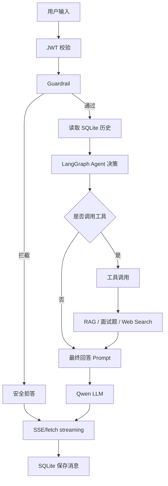

# Agent 工作流

## 工作流图



## 关键设计

- 工具选择阶段和最终回答阶段分离，避免模型在没有真实来源时编造引用。
- 当 `tool_sources_count=0` 时，最终 prompt 注入 `NO_SOURCES=true`，禁止输出参考来源。
- 当工具真实返回 sources 时，后端通过 SSE `event: sources` 单独发送来源数据。
- Web Search 会注入 `CURRENT_DATE` 和 `SOURCE_DATE`，避免把来源发布日期误称为“今天”。
- 前端使用 fetch ReadableStream 读取 SSE，支持 AbortController 停止生成。

## 工具列表

| 工具 | 说明 |
| --- | --- |
| `rag_search(query)` | 检索本地知识库 |
| `interview_question_search(keyword)` | 搜索面试鸭面试题 |
| `web_search(query)` | BigModel MCP Web Search，失败 fallback DuckDuckGo |

## 观测日志

典型日志：

```text
Agent chat request conversationId=1 user_message='...' used_langgraph=True selected_tools=['web_search'] used_tools=['web_search'] tool_sources_count=5
Agent tool called: web_search source_count=5 source_type=mcp
FINAL_CURRENT_DATE=2026-05-14
FINAL_SYSTEM_PROMPT_PREVIEW=...
```
