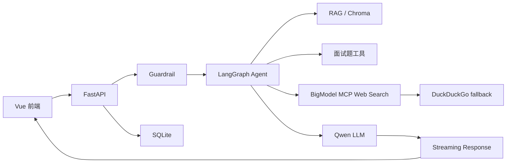

# 系统架构

## 架构图

## 模块说明

- Vue 前端：负责登录注册、会话列表、聊天窗口、停止生成、参考来源折叠展示。
- FastAPI：提供认证、会话、消息、工具调试、RAG 调试和聊天 SSE 接口。
- Guardrail：在 Agent 和工具调用前检查危险输入。
- LangGraph Agent：由模型基于工具描述自主选择是否调用工具。
- RAG：基于本地文档、embedding 和 Chroma 向量库检索上下文。
- 面试题工具：抓取面试鸭搜索结果。
- Web Search：优先 BigModel MCP Web Search，失败时 DuckDuckGo fallback。
- Qwen LLM：OpenAI-compatible 流式模型调用。
- SQLite：保存用户、会话和消息。

## 数据流

1. 用户在 Vue 前端发送消息。
2. 前端携带 JWT 调用 `GET /api/ai/chat`。
3. FastAPI 校验登录态和会话归属。
4. Guardrail 检查用户输入。
5. 后端读取 SQLite 历史消息。
6. LangGraph Agent 决定工具调用。
7. 工具结果进入最终回答 prompt。
8. Qwen LLM 生成流式回答。
9. SSE 返回文本流和 `event: sources`。
10. 后端保存用户消息和最终助手回答。
